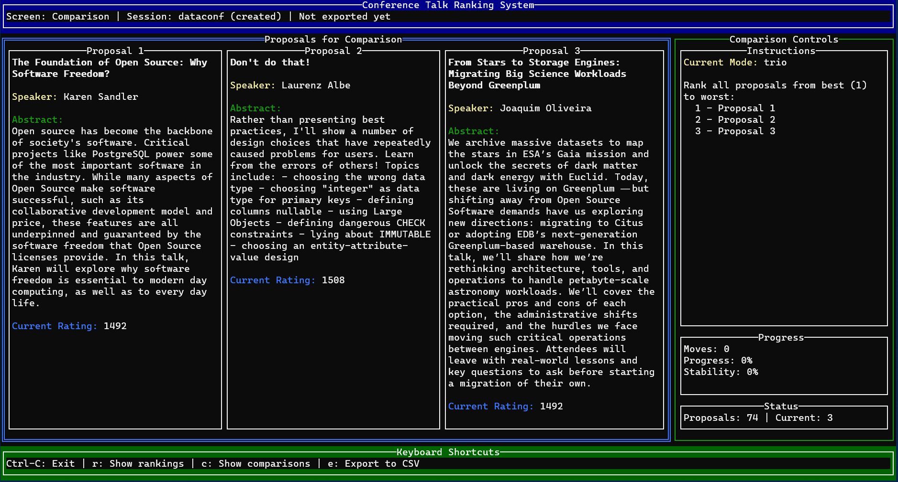

[](https://opensource.org/licenses/MIT)
[](https://github.com/pashagolub/confelo/actions/workflows/build.yml)
[](https://github.com/pashagolub/confelo/releases)
[](https://coveralls.io/github/pashagolub/confelo?branch=master)

# Confelo - Conference Talk Ranking System

[](confelo.png)

A privacy-first terminal application for ranking conference talk proposals using the proven Elo rating system.

## Why Elo Rating for Conference Talks?

The **Elo rating system** was invented by Arpad Elo for chess rankings, but it's perfect for conference talk selection because:

- **Relative Comparison**: Instead of scoring talks in isolation, you compare them head-to-head, which mirrors how program committees naturally think
- **Fewer Decisions**: With 50 proposals, scoring each individually requires 50 decisions, but Elo ranking can produce reliable results with just 20-30 comparisons
- **Handles Subjectivity**: Different reviewers have different standards - Elo focuses on relative preferences rather than absolute scores
- **Proven Mathematics**: Used successfully in chess, sports rankings, and online gaming for decades
- **Confidence Building**: Naturally identifies when you've done enough comparisons to trust the ranking

**Perfect for**: Conference program committees, hackathon judging, grant proposal review, or any scenario where you need to rank subjective submissions.

## Key Features

- **Privacy-First**: All data stays on your computer - no internet required
- **Smart Comparisons**: Focuses on close matchups where your input matters most  
- **Multiple Formats**: Compare 2, 3, or 4 proposals at once
- **Automatic Stopping**: Tells you when you've done enough comparisons
- **CSV Import/Export**: Works with your existing spreadsheets

## Quick Start

### Prerequisites

- Go 1.25 or later
- Terminal with color support (recommended)

### Installation

```bash
# Clone the repository
git clone https://github.com/pashagolub/confelo.git
cd confelo

# Build the application
go build ./cmd/confelo
```

### Basic Usage

1. **Prepare your data**: Create/download a CSV file with conference proposals
   - Required columns: `id`, `title`, `speaker`
   - Optional: `abstract`, `track`, and other metadata columns

2. **Start a new ranking session**:

   ```bash
   # Linux/macOS
   ./confelo --session-name "MyConf2025" --input proposals.csv
   
   # Windows
   confelo.exe --session-name "MyConf2025" --input proposals.csv
   ```

3. **Resume an existing session** (no input file needed):

   ```bash
   ./confelo --session-name "MyConf2025"
   ```

4. **Make comparisons**: Use the interactive terminal interface to compare proposals
   - Number keys to enter proposals order
   - Enter to select your preference
   - 'r' key to view current rankings
   - 'e' key to export results
   - Ctrl+C to exit and save

## How It Works

**Confelo** automatically detects whether you're starting a new session or resuming an existing one based on the session name you provide. No subcommands needed!

- **New Session**: If the session doesn't exist, you must provide a CSV file with `--input`
- **Resume Session**: If the session exists, it loads your previous progress

The application uses the **Elo rating system** to intelligently select which proposals to compare next, focusing on matchups where your decision will have the most impact on the final ranking.

## Options

All configuration is done via command-line arguments:

```bash
confelo [OPTIONS]

Required:
  --session-name string    Session name (creates new if not found, resumes if exists)

For new sessions:
  --input string          CSV file path (required for new sessions)

Optional settings:
  --comparison-mode string    Comparison method: pairwise, trio, quartet (default: pairwise)
  --initial-rating float      Starting Elo rating for proposals (default: 1500.0)
  --output-scale string       Rating scale format like "0-100" or "1.0-5.0" (default: "0-100")
  --target-accepted int       Number of proposals to accept (default: 10)

Other options:
  --verbose                Enable detailed output
  --version               Show version information
  --help                  Show help message
```

### CSV Format Requirements

Your CSV file must have these columns with a header row:

- `id` - Unique identifier for each proposal
- `title` - Proposal title
- `speaker` - Speaker name

Example CSV:

```csv
id,title,speaker,abstract
PROP001,"Building Resilient Microservices","Sarah Chen","In this talk, we'll explore..."
PROP002,"Modern Web Development","Alex Kumar","Discover how TypeScript..."
```

## Example Workflow

1. **Start your first session**:

   ```bash
   ./confelo --session-name "DevConf2025" --input my-proposals.csv
   ```

2. **Make some comparisons** in the interactive interface, then exit (Ctrl+C)

3. **Resume later** to continue where you left off:

   ```bash
   ./confelo --session-name "DevConf2025"
   ```

4. **Export results** when done:
   - Press 'e' in the interface to export ranked proposals to `my-proposals.csv`

## Algorithm Details

### How Elo Rating Works

Confelo uses the standard Chess Elo rating system:

- **Expected Score**: $E_A = \frac{1}{1 + 10^{(R_B - R_A) / 400}}$
- **Rating Update**: $R'_A = R_A + K \cdot (S_A - E_A)$

Where $K=32$ (sensitivity factor), and scores are $S_A = 1$ for win, $S_A = 0$ for loss.

### Multi-Proposal Comparisons

- **Trio**: You rank 3 proposals (1st, 2nd, 3rd), which creates 3 pairwise comparisons
- **Quartet**: You rank 4 proposals, which creates 6 pairwise comparisons
- All modes use the same proven Elo mathematics for consistency

### When to Stop

Confelo automatically detects when you've done enough comparisons based on:

- Rating stability (changes become smaller)
- Ranking stability (top proposals stop changing positions)
- Sufficient coverage (each proposal compared enough times)

## Contributing

We welcome contributions! Please:

1. Fork the repository
2. Create a feature branch (`git checkout -b feature/amazing-feature`)
3. Write tests for your changes
4. Ensure tests pass (`go test ./...`)
5. Commit your changes (`git commit -m 'Add amazing feature'`)
6. Push to your branch (`git push origin feature/amazing-feature`)
7. Open a Pull Request

## License

This project is licensed under the MIT License - see the [LICENSE](LICENSE) file for details.

## Acknowledgments

- Elo rating system invented by Arpad Elo for chess rankings
- Inspired by conference program committee workflows
- Built with Go's tview library for terminal interfaces
